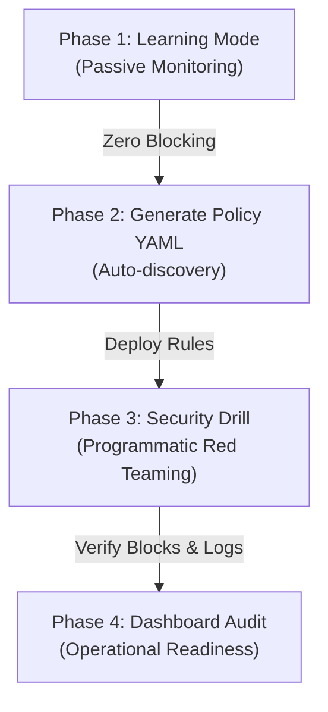
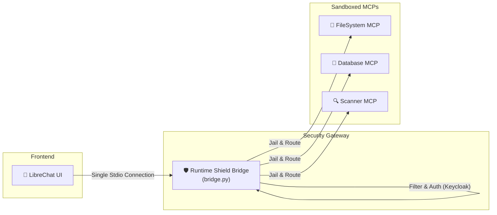

# 🚀 Runtime Shield — Developer & User Onboarding Guide

Welcome to the **Runtime Shield** onboarding guide. This document details how to integrate your autonomous AI agents with the Shield, run a low-friction proof-of-concept (pilot), and configure standard clients like **LibreChat** to secure multiple Model Context Protocol (MCP) servers with zero code modifications.

---

## 🛡️ 1. Integration Friction: Do You Need an API or SDK?

The Runtime Shield is built to be **non-intrusive and low-friction**. In most common configurations, **no code changes or client SDKs are required**.

### Client Integration Modes

| Client Type | Integration Method | SDK Required? | Code Changes? | Description |
| :--- | :--- | :---: | :---: | :--- |
| **Standard Desktop/CLI Clients** (e.g., Claude Desktop, Cursor) | **Stdio Interception Mode** | ❌ **No** | ❌ **No** | The client spawns the Shield bridge as its MCP server. The bridge transparently intercepts stdio streams, checks policies, and routes requests to the underlying tools. |
| **Standard LLM Web UIs** (e.g., LibreChat) | **Stdio or SSE Interception** | ❌ **No** | ❌ **No** | LibreChat routes tool commands directly to the Shield Bridge over stdio or SSE. The Shield acts as the single unified gateway for all underlying MCP servers. |
| **Custom Codebase Agents** (e.g., LangChain, ReAct loops) | **SSO HTTP Proxy / REST API** | ⚠️ **Optional** | ⚠️ **Minimal** | Change your LLM API `base_url` to target the Shield Proxy (`http://localhost:5001/v1`). You can use the lightweight Python SDK (`shield_sdk.py`) to wrap tool calls programmatically. |

### API Key Requirements
* **Fully Offline Local Execution:** By default, Runtime Shield runs **100% locally**. It uses local YAML policies (`mcp-firewall.yaml`) and **Microsoft Presidio NLP** (running locally) to redact PII (emails, SSNs, credit cards) without calling external APIs.
* **Optional Cloud Safety (NVIDIA NIM):** An `NVIDIA_API_KEY` is **only** required if you choose to enable advanced Jailbreak and Topical Guardrail checks (via Llama Guard 4). If disabled in config, the system defaults to local rules.

---

## ✈️ 2. The Pilot Roadmap ("Let's Do a Pilot")

When clients or stakeholders want to run a pilot, the goal is to demonstrate security value without breaking existing agent workflows. 



### Phase 1: Learning Mode (Passive Discovery)
Run the Shield Bridge with the learning flag enabled:
```powershell
python bridge.py --learning
```
* **Outcome:** The Shield intercepts all tool calls but **never blocks them** (risk score stays 0). It transparently builds a baseline of legitimate tools and parameters, logging them directly to `discovery.log`.

### Phase 2: Automatic Policy & Test Case Generation
Once the agent has been run through common user queries, run the automatic policy compiler to convert the discovery baseline into strict firewall rules:
```powershell
# Compiles discovery.log into mcp-firewall rules
python -c "import telemetry; print(telemetry.get_registered_tools())"
```
Or trigger the `keycloak_generate_policy` tool to output a production-ready ruleset for `mcp-firewall.yaml` **along with auto-generated test cases** to verify your policy setup.

### Phase 3: Automated Security Drills & Policy Verification
Turn off learning mode (`LEARNING_MODE=false`) and execute policy validation. You can verify that rules successfully block traversals and honeypots, and redact PII, using the following automated tools:

#### 1. Standalone Verification (Local Terminal)
Run the pre-defined test suite locally:
```powershell
python run_security_drills.py
```
* **Outcome**: Evaluates rules against 10 critical security scenarios (Directory Traversal, Admin RBAC, Honeypots, and PII Redaction) and prints a compliance posture report.

#### 2. Remote Verification (Dokploy / Production)
If the Shield is deployed inside containers on **Dokploy** (where CLI/terminal access is restricted), you can execute drills directly via the authenticated agent chat using the admin-only MCP tool:
```
keycloak_run_drills
```
* **Outcome**: Triggers the same internal verification suite against the active gateway and returns a markdown compliance audit table.

### Phase 4: Security Dashboard Audit
Open `http://localhost:9090` to view the live dashboard. Review the logs for:
* **Total Tool Calls** and **Blocked/Redacted Actions**.
* **Risk Score Increments** (Layer 4 Fraud Engine) and session quarantines.
* **Audit Trails** of precisely why a rule was triggered.

---

## 🔌 3. Simple Usecase: Integrating LibreChat with Multiple MCPs

If you are running **LibreChat** and want to connect it to multiple MCP servers (e.g., a filesystem server, a database server, and a scanner), the Runtime Shield intercepts the connections to act as a **unified security gateway**. 

Instead of LibreChat calling individual tool servers directly, LibreChat talks to the Shield Bridge, and the Shield handles authentication, verification, and sandboxed execution.



### Step-by-Step Integration

### Step 1: Register Your Multiple MCP Servers in Runtime Shield
Define all the target MCP servers in the Shield's `mcp-firewall.yaml` file under the `mcp_servers` configuration block:

```yaml
# mcp-firewall.yaml
mcp_servers:
  filesystem-provider:
    command: "node"
    args: ["./dist/index.js", "."]
    tools:
      - name: "read_file"
        scope: "tool:read_file"
      - name: "write_file"
        scope: "tool:write_file"
      - name: "list_directory"
        scope: "tool:list_directory"
  
  database-provider:
    command: "python"
    args: ["-u", "./database_mcp.py"]
    tools:
      - name: "GetCurrentUser"
        scope: "tool:keycloak_read"
      - name: "GetUserTransactions"
        scope: "tool:keycloak_read"

  scanner-provider:
    command: "python"
    args: ["-u", "./scanner_mcp.py"]
    tools:
      - name: "ScanDependencies"
        scope: "tool:keycloak_read"
```

### Step 2: Configure LibreChat to Use the Shield Gateway
Open your LibreChat configuration file (typically `librechat.yaml`) and define a single stdio connection pointing to the Runtime Shield. 

Since the Shield intercepts and multiplexes commands, LibreChat only needs to connect to **this single proxy**:

```yaml
# librechat.yaml
mcpServers:
  runtime-shield-gateway:
    type: stdio
    command: "python"
    args:
      - "C:/Users/kavya/OneDrive/Desktop/Runtime-shield-for-agentic-systems/bridge.py"
    # Optional: If you run with specific environment configurations
    env:
      RUNTIME_ROLE: "user"
      KEYCLOAK_URL: "http://localhost:8080"
```
> [!IMPORTANT]
> Adjust the absolute path to `bridge.py` based on your host system environment. Ensure the Python executable is in the system path or point to your virtual environment's interpreter (e.g. `C:/Users/kavya/OneDrive/Desktop/Runtime-shield-for-agentic-systems/venv/Scripts/python.exe`).

### Step 3: Launch Keycloak & SPIRE Services
The Shield relies on Keycloak for identity management and SPIFFE/SPIRE for cryptographically attesting workloads. Launch the dockerized services:
```bash
docker-compose up -d
```

### Step 4: Define Firewalls & Permissions
Adjust the rules in `mcp-firewall.yaml` to specify what tools different user roles can access:
* **Allow FS Tools to specific zones:** Allow reading files inside `secure-experiment-zone/`.
* **Block Traversal:** Deny path arguments matching `**/../*` or system folders.
* **RBAC:** Specify that only users with the `admin` role in their Keycloak token can execute Keycloak administrative tools or scan dependencies.

### Step 5: Start LibreChat and Run Queries
1. Restart your LibreChat service to load the new `librechat.yaml`.
2. Ask the assistant:
   * *"List the files in the directory secure-experiment-zone"* -> Shield validates, allows, and routes to `filesystem-provider`.
   * *"Read the file ../../etc/passwd"* -> Shield detects directory traversal, returns a `Security violation` block response, and reports a security alert on the live dashboard.
3. Open `http://localhost:9090` to monitor the logs, risk trends, and blocks in real-time.
